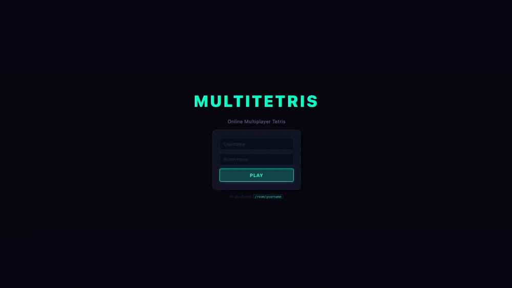

# Multi Tetris

An online multiplayer Tetris game built in Javascript, with Node.js & socket.io on the server, React & Redux on the client.



## Stack

- **Server** : Node.js, socket.io, prototype-based OOP (`Player`, `Piece`, `Game`)
- **Client** : React 18, Redux Toolkit, React Router, socket.io-client (no `this`, no Canvas/SVG/jQuery)
- **Shared** : pure, immutable Tetris engine (board, pieces, rules, rotations)
- **Tests** : Mocha, Chai, Sinon · **92%+ coverage** across statements, branches, functions, and lines

## Usage

### Development

```bash
make dev
```

This installs dependencies if needed, then runs the client (Vite dev server, default `http://localhost:5173`) and the game server (`http://localhost:3004`) together. Open `http://localhost:5173` to play.

Run them separately if you only need one:

```bash
make client   # Vite dev server only
make server   # game server only (nodemon + debug logs)
```

### Production build

```bash
npm run client-dist   # compiles the React app into src/client/dist/
npm run srv-dist      # serves it from http://localhost:3004
```

The server's host/port are configurable in `params.js`.

### Play

Open `http://localhost:3004/<room>/<your_name>` in a browser, or navigate to `/` and fill in the form.

- The first player to join a room becomes the host and can start the game.
- Multiple rooms run concurrently.
- Once a game is started, new players must wait for the next round.

**Controls:** `← →` move · `↑` rotate · `↓` soft drop · `Space` hard drop

## Tests

```bash
make test    # or: npm test
```

### Coverage report

```bash
npm run coverage
```

Coverage targets (all met):

| Metric     | Required | Actual |
|------------|----------|--------|
| Statements | ≥ 70%    | ~93%   |
| Functions  | ≥ 70%    | ~95%   |
| Lines      | ≥ 70%    | ~93%   |
| Branches   | ≥ 50%    | ~92%   |
